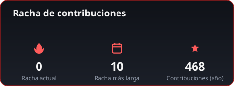
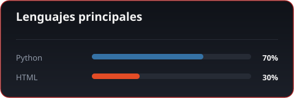

 

&nbsp;

 

Desarrollador de software enfocado en aplicaciones de escritorio, herramientas de automatización y desarrollo web. Disfruto construir proyectos prácticos y explorar distintos niveles de la pila tecnológica.

 

### Stack

 

### Estadísticas

 

### Racha de contribuciones

 

### Lenguajes principales

Estos gráficos se generan automáticamente todos los días mediante GitHub Actions, a partir de datos reales de la API de GitHub (ver <code>scripts/generate_assets.py</code>).

 

### Proyectos destacados

<table>
<tr>
<td width="50%">

</td>
<td width="50%">

</td>
</tr>
</table>

 

